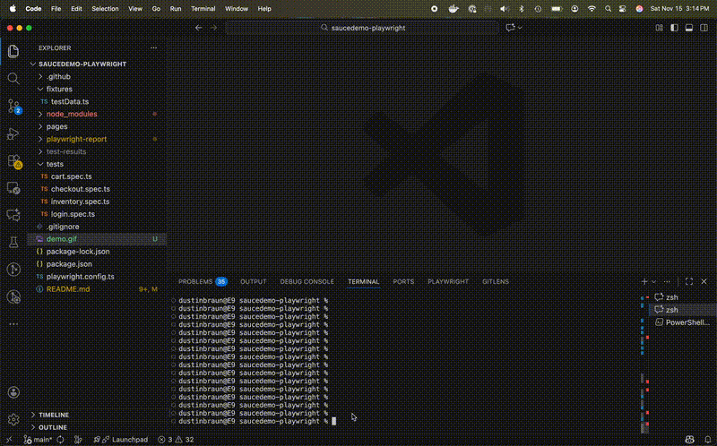

<div align="center">
  <h1>🧪 Playwright UI Automation Framework</h1>
  <strong>Modern, maintainable end-to-end automation using Playwright, TypeScript, and the Page Object Model.</strong>
  <br><br>
  
  
  
  
  <br>
  
  
</div>

---

## 🎯 Why This Project Matters

**Most QA portfolios only show simple scripts. This repo demonstrates real-world automation capability:**

- ✅ **Clean Architecture** - Page Object Model pattern with proper encapsulation and reusability
- ✅ **Comprehensive Coverage** - 25+ tests across authentication, inventory, cart, and checkout flows
- ✅ **Production-Ready** - CI/CD pipeline with GitHub Actions, automated testing on every push
- ✅ **Modern Stack** - TypeScript with Playwright, following current industry standards
- ✅ **Best Practices** - Centralized test data, JSDoc documentation, AAA test pattern
- ✅ **Robust Selectors** - Data-test attributes and defensive locator strategies
- ✅ **Cross-Browser** - Configured for Chromium, Firefox, and WebKit testing
- ✅ **Professional Reporting** - HTML reports with screenshots and videos on failure
- ✅ **Maintainable** - DRY principles, clear naming conventions, and comprehensive comments

**This isn't just test automation—it's a scalable framework that shows enterprise-level thinking.**

---

## 🎬 Demo



*Automated end-to-end checkout flow running in Chromium*

---

## 📋 Overview

A production-ready UI automation framework built using Playwright, TypeScript, and the Page Object Model (POM) pattern.
This project demonstrates clean automation architecture, comprehensive test coverage, and CI/CD integration — all aligned with real-world QA Engineer workflows.

📚 **Documentation**:
- [Test Strategy](./docs/TestStrategy.md) - Comprehensive testing approach and methodology
- [Test Plan](./docs/TestPlan.md) - Detailed test planning and execution strategy  
- [Architecture](./docs/Architecture.md) - Framework design and technical architecture

---

## 🚀 Tech Stack

- Playwright (TypeScript)
- Page Object Model (POM)
- GitHub Actions (Continuous Integration)
- Node.js
- HTML Reporter
- Cross-browser testing (Chromium, Firefox, WebKit)

---

## 📁 Project Structure

```text
saucedemo-playwright/
├── tests/                 # Test specs
│   ├── login.spec.ts
│   ├── inventory.spec.ts
│   ├── cart.spec.ts
│   └── checkout.spec.ts
│
├── pages/                 # Page Object Model classes
│   ├── BasePage.ts
│   ├── LoginPage.ts
│   ├── InventoryPage.ts
│   ├── CartPage.ts
│   └── CheckoutPage.ts
│
├── fixtures/              # Test data
│   └── testData.ts
│
├── playwright.config.ts   # Global Playwright settings
├── package.json
│
└── .github/workflows/     # CI pipeline
    └── playwright.yml
```

---

## 🧪 Features & Tests Included

### ✔️ Login tests

- Valid login
- Invalid login (error validation)

### ✔️ Inventory tests

- Add item to cart
- Navigate from inventory → cart

### ✔️ Cart & Checkout tests

- Start checkout
- Fill user information
- Complete the purchase
- Validate confirmation screen

### ✔️ Page Object Model (POM)

- LoginPage
- InventoryPage
- CartPage
- CheckoutPage
- BasePage (shared functionality)

### ✔️ CI Integration

- GitHub Actions workflow triggers on push and pull requests
- Ensures all tests run headless in CI

---

## ▶️ Running Tests Locally

Install dependencies:

```bash
npm install
```

Run all Playwright tests:

```bash
npx playwright test
```

View the HTML test report:

```bash
npx playwright show-report
```

Run tests in headed mode:

```bash
npx playwright test --headed
```

Run a specific test file:

```bash
npx playwright test tests/login.spec.ts
```

---

## 🤖 Continuous Integration (CI)

GitHub Actions workflow automatically runs:

- `npm ci`
- Install Playwright browsers
- All test specs
- Generate report artifacts

On:

- Push to main
- Pull requests

Workflow file: `.github/workflows/playwright.yml`
